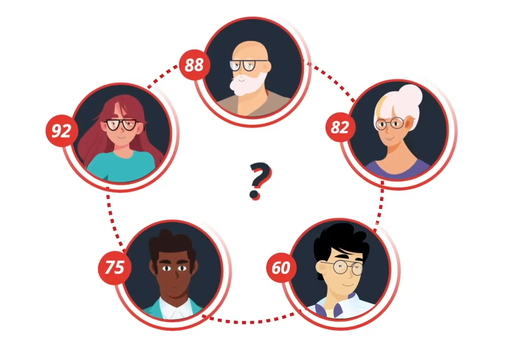

# Devoir de M2 DEFI - Data Visualisation
M2 DEFI - Data Visualisation

# Présentation du sujet : Contexte et problématique

# Sommaire 
1. intro choix
2. Visualisation de l’espérance de vie de 30 à 80 ans selon le niveau d’éducation 
3. traitement
4. 

# Jeu de données

Datacleaning
modification

### Voici un extrait du fichier traité:

| Diplôme       | 30 ans | 31 ans | 32 ans | 33 ans |
| ------------- | ------ | ------ | ------ | ------ |
| Sans diplôme  | 52,9   | 52,0   | 51,0   | 50,0   |
| Brevet        | 55,3   | 54,4   | 53,4   | 52,4   |
| CAP-BEP       | 56,1   | 55,1   | 54,1   | 53,2   |
| Baccalauréat  | 56,7   | 55,8   | 54,8   | 53,8   |
| Supérieur     | 57,1   | 56,1   | 55,1   | 54,1   |
| Ensemble      | 55,4   | 54,4   | 53,4   | 52,4   |

> Tableau généré avec [Tables Generator](https://www.tablesgenerator.com)

## Première visualisation

Analyse

## Visualisation de l’espérance de vie de 30 à 80 ans selon le niveau d’éducation 

<iframe title="Age conjoncturel de départ à la retraite" aria-label="Stacked Bars" id="datawrapper-chart-F5xE6" src="https://datawrapper.dwcdn.net/F5xE6/1/" scrolling="no" frameborder="0" style="border: none;" width="600" height="510" data-external="1"></iframe>
https://datawrapper.dwcdn.net/F5xE6/1/

Analyse

## Troisième visualisation

- Premieier
- Deuxième élément
  - Élément imbriqué 1
  - Élément imbriqué 2
- Troisième élément

## Maladies chroniques selon les groupes socioprofessionnel
<iframe title="Inégalité d’espérance de vie due au maladie chronique selon les catégories socioprofessionnelles" aria-label="Grouped Bars" id="datawrapper-chart-5sreo" src="https://datawrapper.dwcdn.net/5sreo/1/" scrolling="no" frameborder="0" style="width: 0; min-width: 100% !important; border: none;" height="4650" data-external="1"></iframe>

Analyse

# Conclusion

